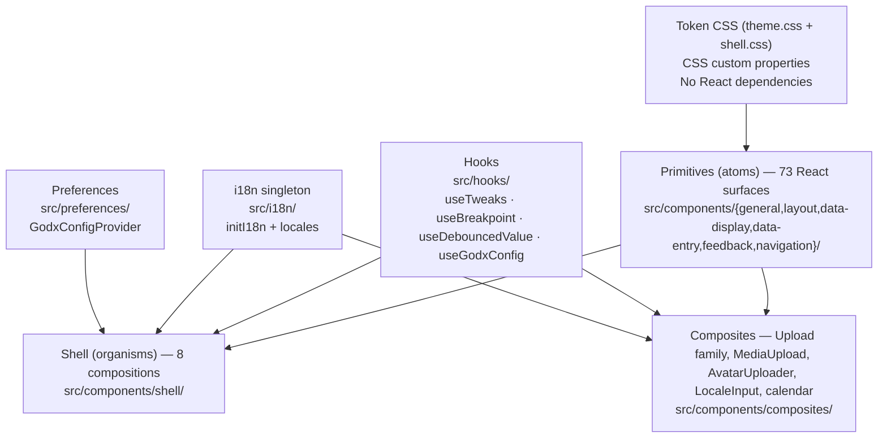

# Architecture

## Layer model

`@godxjp/ui` follows a three-layer Atomic Design model. The
primitive layer is grouped into six folders matching the Ant Design
component taxonomy (cardinal rule 27).



### Layer 1 — Token CSS

`src/styles/theme.css` defines every visual value as a CSS custom
property; `src/styles/shell.css` (plus per-component CSS under
`src/styles/shell/`) carries the canonical class names. The Tailwind v4
entry at `src/tokens/tailwind.css` `@import`s `theme.css` and exposes
tokens via `@theme inline`.

This layer has no React dependency. Services import it once
(`import "@godxjp/ui/tailwind.css"`) and gain the full token system.

See [03 — token system](../../new-docs/03-token-system.md) for the
three-tier architecture (primitive → semantic → variant).

### Layer 2 — Primitives (atoms)

Per cardinal rule 27 primitives live under
`src/components/<group>/<Name>.tsx` where `<group>` is one of six
canonical Ant-shaped names (73 React surfaces total):

| Group | Source | Count | Examples |
|---|---|---|---|
| `general` | `src/components/general/` | 2 | Button, Typography |
| `layout` | `src/components/layout/` | 6 | Row, Col, Flex, Space, Grid, Masonry |
| `data-display` | `src/components/data-display/` | 20 | Avatar, Card, Table, Tag, Statistic, … |
| `data-entry` | `src/components/data-entry/` | 24 | Input, Select, Form, DateTimePicker, … |
| `feedback` | `src/components/feedback/` | 11 | Alert, Dialog, Sheet, Skeleton, Spinner, … |
| `navigation` | `src/components/navigation/` | 7 | Anchor, Breadcrumb, Menu, Tabs, Pagination, Steps, DropdownMenu |

The barrel `src/components/primitives.ts` (single file) re-exports
every group so consumers see one stable import path
`@godxjp/ui/components/primitives`.

Each primitive:

- Applies CSS classes from the token layer.
- Wraps a Radix UI / cmdk / sonner / react-aria-components primitive
  where keyboard navigation, ARIA, or focus management is needed
  (cardinal rule 14).
- Exports its props type explicitly with `forwardRef`.
- Honours every prop in [04 — prop vocabulary](../../new-docs/04-prop-vocabulary.md).

Primitives know nothing about the shell layout or the i18n system.

### Layer 3a — Shell (organisms)

`src/components/shell/` contains 8 compositions that form the
portal chrome: AppShell, Sidebar, Topbar, TweaksPanel,
CommandPalette, ProductSwitcher, ProjectSwitcher, PageContent.

Shell components:

- Depend on primitives from Layer 2.
- Use `useTweaks` / `useBreakpoint` for persistent display-settings state.
- Use `react-i18next` for translated labels (`t("shell.pickProduct")` etc.).
- Accept product/project data via props (no built-in fixture is shipped — consumers register their own catalogues).

### Layer 3b — Composites

`src/components/composites/` contains widgets that wrap multiple
primitives:

- `composites/upload/` — Upload, ImageUpload, AvatarUploader,
  MediaUpload (with bundled `media-client.ts` — the media-service
  client lives with the composite that uses it per cardinal rule
  28 §D, not at a separate top-level `src/clients/`).
- `composites/locale-input/` — LocaleInput composite for
  locale-aware text input.
- `calendar/` — Calendar app (MiniMonth, TimeGrid, MonthView,
  WeekView, DayView, AgendaView shared between `data-display/`
  and composites).

### Supporting layers — Hooks, i18n, Preferences

| Layer | Location | Consumed by |
|---|---|---|
| Hooks (`useTweaks`, `useBreakpoint`, `useDebouncedValue`, …) | `src/hooks/` | Shell, Composites |
| i18next singleton | `src/i18n/` | Shell, Composites, any component that needs translated text |
| `GodxConfigProvider` | `src/preferences/` | Shell — locale + timezone React context |

### What is NOT a layer

Per cardinal rule 28 §D, the following are forbidden as top-level
`src/` directories: `src/clients/`, `src/screens/`, `src/data/`,
`src/lib/`, `src/utils/`, `src/internal/`. Example screens that
demonstrate page composition live under `src/stories/examples/` and
are Storybook-only — they never ship in `dist/`. Consumers
copy-paste-and-modify those examples; they do NOT `import` them.

---

## Package boundary

The package boundary is the `package.json::exports` map. Today's
eight runtime entries are listed in
[02 — consumer contract §A](../../new-docs/02-consumer-contract.md#a--consumer-dist-surface-eight-entries).

Nothing outside that map is part of the public API. Internal helpers
(e.g. `src/components/cn.ts`) are in-package utilities and are not
exported.

Changes to exported types are version-controlled under SemVer.
Changes to unexported internals are not breaking changes.

---

## Submodule relationship

`@godxjp/ui` is a git submodule pinned inside the `godx-admin`
monorepo at `libs/ts/godxjp-ui/`. The canonical source is
`github.com/godx-jp/godxjp-ui`.

```
godx-admin (umbrella monorepo)
└── libs/ts/godxjp-ui/  ← git submodule SHA pin
    ├── src/
    ├── dist/           ← built output (not committed)
    └── docs/           ← this documentation tree
```

The umbrella sees only the SHA pin. Changes to the submodule require:
1. A PR to `godx-jp/godxjp-ui main`.
2. A second PR to the umbrella that bumps the SHA pin.

This ensures the umbrella never points to a SHA that doesn't exist
on the submodule remote.

---

## See also

- [Design philosophy](./design-philosophy.md) — the three pillars that shaped this architecture.
- [00 — index](../../new-docs/00-index.md) — full binding-rule trigger table.
- [02 — consumer contract §A-2](../../new-docs/02-consumer-contract.md) — per-group source taxonomy.
- [ADR 0001](../adr/0001-radix-as-foundation.md), [ADR 0002](../adr/0002-shadcn-style-not-mui.md), [ADR 0003](../adr/0003-tokens-not-utilities.md).
