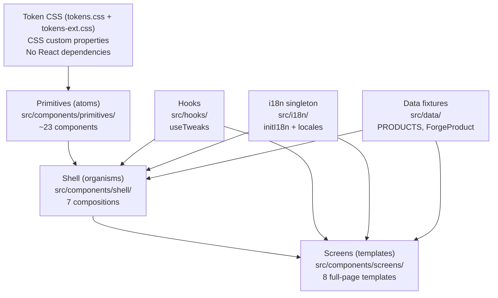

# Architecture

## Layer model

`@godxjp/ui` follows a three-layer Atomic Design model:



### Layer 1 — Token CSS

`src/tokens/tokens.css` and `src/tokens/tokens-ext.css` define every visual value
as a CSS custom property. This layer has no React dependency — it is plain CSS.

Services import it once (`import "@godxjp/ui/tailwind.css"`) and gain the full
token system.

### Layer 2 — Primitives (atoms)

`src/components/primitives/` contains ~23 components: Button, Card, Input, Dialog,
Select, Table, etc. Each primitive:

- Is a React component that applies CSS classes from the token layer.
- Wraps a Radix UI primitive where keyboard navigation, ARIA, or focus management
  is needed.
- Exports its props type explicitly.
- Has a `forwardRef` so consumers can wire focus management.

Primitives know nothing about the shell layout or the i18n system.

### Layer 3a — Shell (organisms)

`src/components/shell/` contains 7 compositions that form the portal chrome:
AppShell, Sidebar, Topbar, TweaksPanel, CommandPalette, ProductSwitcher, ProjectSwitcher.

Shell components:
- Depend on primitives from Layer 2.
- Use `useTweaks` for persistent display-settings state.
- Use `react-i18next` for translated labels (`t("shell.pickProduct")` etc.).
- Accept product/project data via props or from the built-in `PRODUCTS` fixture.

### Layer 3b — Screens (templates)

`src/components/screens/` contains 8 full-page templates: DashboardScreen,
PlansScreen, IssuesScreen, WikiScreen, PlanDetailScreen, IssueDetailScreen,
ProjectsListScreen, IdeasScreen.

Screens:
- Compose primitives and shell classes.
- Carry fixture data for initial renders.
- Are designed to be replaced by live data when integrated into a service — they
  demonstrate the layout, not the data layer.

### Supporting layers — Hooks, i18n, Data

| Layer | Location | Consumed by |
|---|---|---|
| `useTweaks` | `src/hooks/` | Shell, Screens |
| i18next singleton | `src/i18n/` | Shell, Screens, any component that needs translated text |
| PRODUCTS fixture | `src/data/` | Shell (ProductSwitcher, ProjectSwitcher), Screens (DashboardScreen) |

---

## Package boundary

The package boundary is the `package.json::exports` map. Nothing outside that
map is part of the public API. Internal helpers (e.g. `src/components/primitives/cn.ts`)
are in-package utilities and are not exported.

Changes to exported types are version-controlled under SemVer. Changes to
unexported internals are not breaking changes.

---

## Submodule relationship

`@godxjp/ui` is a git submodule pinned inside the `godx-admin` monorepo at
`libs/ts/godxjp-ui/`. The canonical source is `github.com/godx-jp/godxjp-ui`.

```
godx-admin (umbrella monorepo)
└── libs/ts/godxjp-ui/  ← git submodule SHA pin
    ├── src/
    ├── dist/           ← built output (not committed)
    └── docs/           ← this documentation tree
```

The umbrella sees only the SHA pin. Changes to the submodule require:
1. A PR to `godx-jp/godxjp-ui main`.
2. A second PR to the umbrella that bumps the SHA pin.

This ensures the umbrella never points to a SHA that doesn't exist on the
submodule remote.

---

## See also

- [Design philosophy](./design-philosophy.md) — the three pillars that shaped this architecture.
- [ADR 0001](../adr/0001-radix-as-foundation.md), [ADR 0002](../adr/0002-shadcn-style-not-mui.md), [ADR 0003](../adr/0003-tokens-not-utilities.md).
